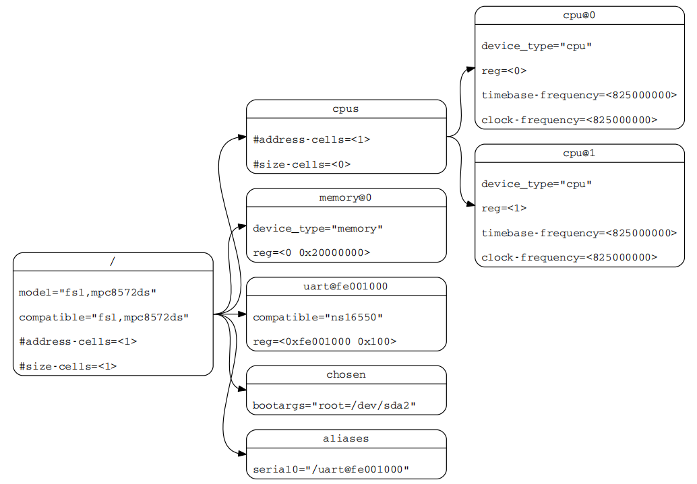
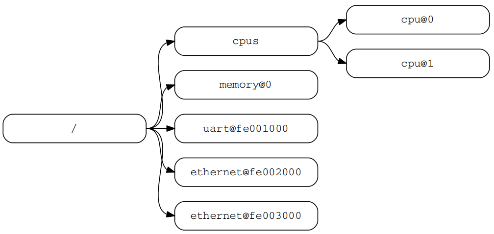
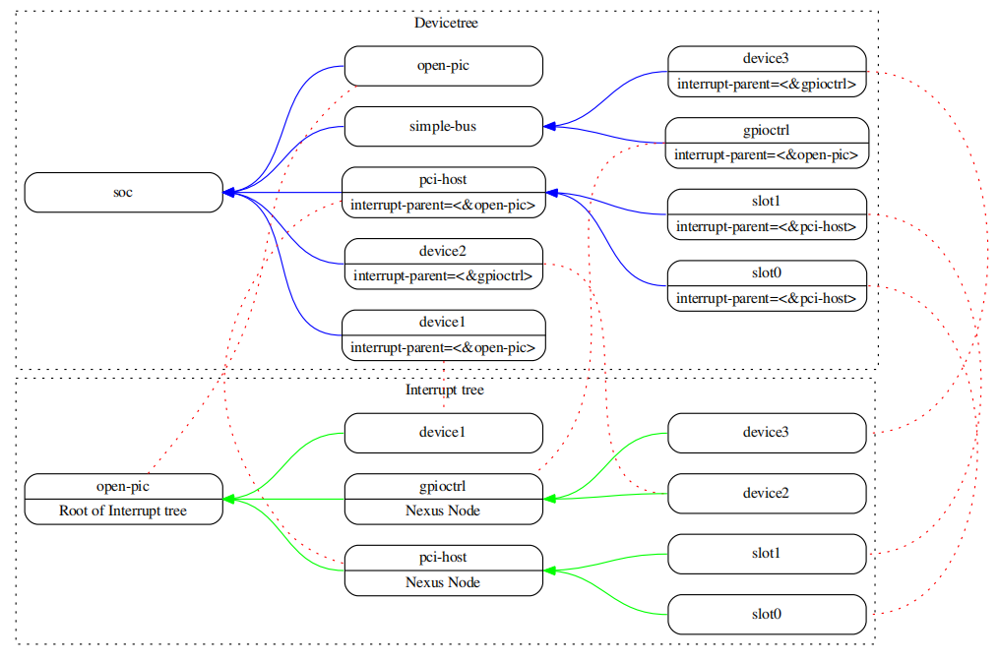
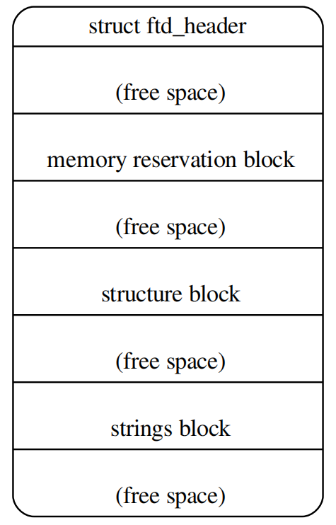

翻译根据有道云以及自己修订，结合原文阅读，图片来源于英文原文档。linux内核源码的Document/devicetree目录下有很多使用说明文档供参考，开发时能用于参考，不过分布相对零散。

注意：由于原文档中对于属性的描述有很多表格，但是基本除了Description其他都不需要翻译，因此后续的翻译中，不会涉及到这部分连续的表格属性，建议直接阅读英文原文档中的属性表格以及Document/devicetree目录下的txt文档（写的很详细）。

刚接触的阶段，只需要知道设备树是用于描述设备属性的一种树状结构即可，然后理清熟悉一些通用的基本属性，这些属性是怎么表示以及描述的，规范要求这些属性怎么编写。一般原厂基本都写好了芯片级的dtsi，然后由板级相关的dts文件去包含这个dtsi文件，所以一般来说dtsi文件不需要改动，我们下游厂家做的一般都是板级相关的修改。比如说更改了某个芯片，然后需要对板级相关的dts文件进行修改，适配更换后的芯片相关的属性。linux内核源码的Document/devicetree目录下每一份txt文件都写的很详细，每个属性都有说明。开发时可以多参考。

根据节点中的compatible属性去匹配驱动，可以在源码中搜索节点中使用的compatible的值，找到对应的驱动代码所在的源文件，然后从源代码进行分析，是怎么从dtb文件中读取相关的属性值，然后使用这些属性值做了什么操作。

针对dtb文件格式还可以分析一下内部的存储结构，以及使用dtc文件将dtb文件反译为dts文件，然后再看下这个dts文件内部整合后是怎么样的。因为编写时是一个dts包含另一个dts，另一个dts又包含dtsi这样，所以如果直接分析起来，是相对比较繁琐的，因为一直有其他的dts文件去引用节点加入或更新新的属性，而dtc文件将dtb文件反译为dts文件，只会生成一个dts文件，并且是已经整合后的，分析起来相对完整。

------

**Devicetree Specifification** 设备树规范

**Release v0.3** 英文原版发布版 v0.3

**devicetree.org** [The Devicetree Project](https://www.devicetree.org/)

**13 February 2020** 发布日期：2020/2/13

翻译日期：2023/11/22，以下的“本”均指的是英文原文档。

------

**版权信息**

```
Copyright 2008,2011 Power.org, Inc.
Copyright 2008,2011 Freescale Semiconductor, Inc.
Copyright 2008,2011 International Business Machines Corporation.
Copyright 2016,2017 Linaro, Ltd.
Copyright 2016,2017 Arm, Ltd.
```

**许可证信息**

```
Licensed under the Apache License, Version 2.0 (the “License”); you may not use this file except in compliance with the
License. You may obtain a copy of the License at
http://www.apache.org/licenses/LICENSE-2.0
Unless required by applicable law or agreed to in writing, software distributed under the License is distributed on an “AS
IS” BASIS, WITHOUT WARRANTIES OR CONDITIONS OF ANY KIND, either express or implied. See the License
for the specific language governing permissions and limitations under the License.
```

致谢

```
The devicetree.org Technical Steering Committee would like to thank the many individuals and companies that contributed
to the development of this specification through writing, technical discussions and reviews.
We want to thank the power.org Platform Architecture Technical Subcommittee who developed and published ePAPR.
The text of ePAPR was used as the starting point for this document.
Significant aspects of the Devicetree Specification are based on work done by the Open Firmware Working Group which
developed bindings for IEEE-1275. We would like to acknowledge their contributions.
We would also like to acknowledge the contribution of the PowerPC and ARM Linux communities that developed and
implemented the flattened devicetree concept.
```

英文原文档修订历史表

| Revision版本 | Date日期    | Description描述                                              |
| ------------ | ----------- | ------------------------------------------------------------ |
| 0.1          | 2016-MAY-24 | Initial prerelease version. Imported ePAPR text into reStructured Text format and removed Power ISA specifific elements. |
|              |             | 初始预发布版本。将ePAPR文本导入到reStructured text格式，并删除Power ISA特定的元素。 |
| 0.2          | 2017-DEC-20 | • Added more recommended generic node names<br/>• Added interrupts-extended<br/>• Additional phy times<br/>• Filled out detail in source language chapter<br/>• Editorial changes<br/>• Added changebar version to release documents |
|              |             | •增加了更多推荐的通用节点名称<br/>•增加中断延长<br/>•额外的物理时间<br/>•在源语言章节填写详细信息<br/>•编辑更改<br/>•增加了changebar版本来发布文档 |
| 0.3          | 2020-FEB-13 | • Added more recommended generic node names<br/>• Document generic nexus binding<br/>• codespell support and spelling fixes |
|              |             | •增加了更多推荐的通用节点名称<br/>•文档通用nexus绑定<br/>•代码代码支持和拼写修复 |


------

## 一、INTRODUCTION简介

### 1.1 目的和范围

为了初始化和引导计算机系统，各种软件组件相互作用。固件可能在将控制传递给软件(如操作系统、引导加载程序或管理程序)之前，执行系统硬件的低级初始化。引导加载程序和管理程序可以依次加载并将控制传递给操作系统。标准的、一致的接口和约定促进了这些软件组件之间的交互。在本文档中，术语“引导程序”通常用于指初始化系统状态并执行称为客户端程序的另一个软件组件的软件组件。引导程序的示例包括:固件、引导加载程序和管理程序。客户机程序的示例包括:引导加载程序、管理程序、操作系统和特殊用途程序。一个软件既可以是客户端程序，也可以是引导程序(例如管理程序)。

这个规范，即Devicetree规范(DTSpec)，提供了一个完整的引导程序到客户机程序接口定义，并结合了促进各种系统开发的最低系统需求。

该规范针对嵌入式系统的需求。嵌入式系统通常由系统硬件、操作系统和应用程序软件组成，这些软件是为执行一组固定的、特定的任务而定制的。这与通用计算机不同，通用计算机被设计为由用户使用各种软件和I/O设备进行定制。嵌入式系统的其他特性可能包括:

- 一组固定的I/O设备，可能为应用程序高度定制
- 优化尺寸和成本的系统板
- 有限的用户界面
- 资源约束，如有限的内存和有限的非易失性存储
- 实时约束
- 使用各种各样的操作系统，包括Linux、实时操作系统、定制或专有操作系统

#### 1.1.1 本文件的组织结构

- 第1章介绍DTSpec指定的体系结构。
- 第2章介绍devicetree的概念，并描述了它的逻辑结构和标准属性。
- 第3章详细说明符合dtspec的设备树所需的基本设备节点集的定义。
- 第4章描述特定设备类和特定设备类型的设备绑定**DEVICE BINDINGS**。
- 第5章详细说明设备树的DTB数据结构。
- 第6章详细说明DTS基本结构和规范。

#### 1.1. 2 本文档中的约定

“shall”一词用来表示为符合标准而严格遵守的强制性要求，不允许有任何偏差(“shall”等于“shall”)。

should这个词用来表示在几种可能性中，某一个被推荐为特别合适的，而不提及或排除其他可能性;或者某一行动方案是首选的，但不一定是必需的;或者(在否定形式中)不赞成但不禁止某种行为(should = recommended that)

may这个词用来表示在标准范围内允许的一种行为(may等于允许的)。

devicetree结构的示例经常以devicetree语法的形式显示。有关该语法的概述，请参见第6节。

### 1.2 与IEEE™1275和ePAPR的关系

DTSpec与IEEE1275 Open Firmware标准有松散的关系。- IEEE引导(初始化配置)Firmware标准:核心要求和实践。

DTS的起源于Open Firmware，即是OF。设备树主要用于嵌入式，因此不使用OF的有些规范。

最初的IEEE 1275规范及其衍生规范(如CHRP和PAPR)解决了通用计算机的问题，例如操作系统的单一版本如何在同一系列中的几台不同计算机上工作，以及从用户安装的I/O设备加载操作系统的问题。

由于嵌入式系统的性质，这些问题中的一些在开放的、通用的计算机中并不适用。IEEE 1275规范的显著特性在DTSpec中被省略，包括:

• Plug-in device drivers 插件设备驱动程序

• FCode 

• The programmable Open Firmware user interface based on Forth 基于Forth的可编程开放固件用户界面

• FCode debugging 调试FCode

• Operating system debugging 操作系统调试

从IEEE 1275中保留下来的是来自devicetree体系结构的概念，通过该体系结构，引导程序可以描述系统硬件信息并与客户端程序通信，从而消除了客户端程序对系统硬件的硬编码描述的需要。

本规范部分取代了ePAPR [ePAPR]规范。ePAPR记录了Power ISA如何使用devicetree，并涵盖了一般概念以及Power ISA特定的绑定。该文档的文本来源于ePAPR，但是删除了特定于体系结构的绑定，或者将它们移到了附录中。

### 1.3 32位和64位支持

Devicetree规范（DTSpec）支持具有32位和64位寻址功能的cpu。在适用的情况下，DTSpec的部分描述了32位和64位寻址的任何要求或注意事项。

### 1.4 术语定义说明

**AMP** 非对称多处理。计算机可用的cpu被划分成不同的组，每个组运行一个不同的操作系统映像。cpu可能相同，也可能不相同。

**boot CPU **引导程序指向客户机程序入口点的第一个CPU。

**Book III-E** 嵌入式环境。Power ISA的一部分，定义了嵌入式Power处理器实现中使用的管理器指令和相关设施。

**boot program** 用于泛指一个软件组件，该组件初始化系统状态并执行另一个被称为客户端程序的软件组件。引导程序的示例包括:firmware、bootloaders和Hypervisor。

**client program** 通常包含应用程序或操作系统软件的程序。客户机程序的示例包括:bootloaders、Hypervisor、操作系统和特殊目的程序。

**cell** 由32位组成的信息单位。

**DMA** Direct memory access. 直接存储器访问。

**DTB** Devicetree blob. 设备树的紧凑二进制表示。

**DTC** Devicetree compiler. 一个开源工具，用于从DTS文件创建DTB文件。

**DTS** Devicetree syntax. DTC使用的设备树的文本表示形式。参见附录A Devicetree源格式(版本1)。

**effective address** 由处理器存储访问或分支指令计算的内存地址。

**physical address** 处理器用来访问外部设备(通常是存储器控制器)的地址。

**Power ISA** Power Instruction Set Architecture. 电源指令集体系结构。

**interrupt specififier** 描述中断的属性值。通常包括指定中断号、灵敏度和触发机制的信息。

**secondary CPU** 属于客户端程序的引导CPU以外的CPU被认为是辅助CPU

**SMP** Symmetric multiprocessing. 对称多处理。一种计算机体系结构，其中两个或多个相同的cpu可以共享内存和IO，并在单个操作系统下操作。

**SoC** System on a chip. 集成了一个或多个中央处理器核心以及许多其他外围设备的单个计算机芯片。

**unit address** 节点名称中指定父节点地址空间中节点地址的部分

**quiescent CPU** 静态CPU处于一种状态，它不会干扰其他CPU的正常运行，也不会受到其他正在运行的CPU的正常运行的影响，除非通过显式的方法使能或重新使能静态CPU。

> Book III-E是PowerPC处理器架构的一部分，它是指PowerPC架构的第三册，也称为Embedded PowerPC Architecture。Book III-E描述了PowerPC处理器在嵌入式系统中的应用，包括处理器的指令集、寄存器、内存管理单元（MMU）等方面的内容。它还包括一些与嵌入式系统相关的特性，例如低功耗、实时性、可靠性等。Book III-E是PowerPC架构中的一个重要组成部分，为嵌入式系统开发提供了基础和指导，帮助开发人员设计和实现高性能、低功耗、可靠的嵌入式系统。

## 二、THE DEVICETREE设备树 

### 2.1概述

DTSpec指定了一个称为devicetree的结构来描述系统硬件。引导程序将设备树加载到客户端程序的内存中，并将指向设备树的指针传递给客户端。

本章描述了设备树的逻辑结构，并指定了一组用于描述设备节点的基本属性。第3章指定了符合dtspec的设备树所需的某些设备节点。第4章描述了dtspec定义的设备绑定——表示特定设备类型或设备类别的要求。第5章描述了设备树在内存中的编码结构。

设备树是一种树形数据结构，其节点描述系统中的设备。每个节点都有属性/值（property/value）对，用来描述所表示设备的特征。每个节点只有一个父节点，除了根节点，根节点没有父节点。

符合dtspec的设备树描述了系统中不一定由客户机程序动态检测到的设备信息。例如，PCI的体系结构使客户机能够探测和检测连接的设备，因此可能不需要描述PCI设备的设备树节点。但是，如果不能通过探测检测到系统中的PCI主机桥接设备，则需要一个设备节点来描述它。

**例如：**

图2.1显示了一个简单设备树的示例表示，它几乎足够完整，可以启动一个简单的操作系统，其中描述了平台类型、CPU、内存和单个UART。在每个节点中显示设备节点的属性和值。



​                                                                               图2.1:Devicetree示例

### 2.2 Devicetree结构与约定

#### 2.2.1 Node Names节点名称

**Node Name Requirements**节点名称要求

devicetree中的每个节点都按照以下约定命名:

```cobol
node-name@unit-address
```

其中node-name：指定节点的名称。长度为1 ~ 31个字符，只能由表2.1中的字符集中的字符组成。

表2.1:节点名的有效字符

| Character | Description              |
| --------- | ------------------------ |
| 0-9       | digit数字                |
| a-z       | lowercase letter小写字母 |
| A-Z       | uppercase letter大写字母 |
| ,         | comma逗号                |
| .         | period句号               |
| _         | underscore下划线         |
| \+        | plus sign加号            |
| -         | dash连接号               |

`node-name` 应（shall）以小写或大写字符开头，并应（should）描述设备的一般类别

该名称的`unit-address`特定于节点所在的总线类型。它由一个或多个组成从表2.1中的字符集中取出ASCII字符。`unit-address`必须与节点的reg属性中指定的第一个地址匹配。如果节点没有`reg`属性，则必须省略@`unit-address`，并且仅用`node-name`来区分该节点与树中同级别的其他节点。特定总线的绑定可以为`reg`格式和`unit-address`指定额外的、更具体的要求。

根节点没有节点名或单元地址。它由正斜杠(/)标识。




​																						图2.2:节点名称示例

由图所示：

- 以cpu为名称的节点，其单位地址值分别为0和1。
- 以ethernet为名称的节点，其单位地址值fe002000和fe003000来区分。

#### 2.2.2 通用名推荐

节点的名称应该是通用的，反映设备的功能，而不是其精确的编程模型。如果合适，名称应该是以下选择之一:

• adc

• accelerometer

• atm

• audio-codec

• audio-controller

• backlight

• bluetooth

• bus

• cache-controller

• camera

• can

• charger

• clock

• clock-controller

• compact-flflash

• cpu

• cpus

• crypto

• disk

• display

• dma-controller

• dsi

• dsp

• eeprom

• efuse

• endpoint

• ethernet

• ethernet-phy

• fdc

• flflash

• gnss

• gpio

• gpu

• gyrometer

• hdmi

• hwlock

• i2c

• i2c-mux

• ide

• interrupt-controller

• iommu

• isa

• keyboard

• key

• keys

• lcd-controller

• led

• leds

• led-controller

• light-sensor

• magnetometer

• mailbox

• mdio

• memory

• memory-controller

• mmc

• mmc-slot

• mouse

• nand-controller

• nvram

• oscillator

• parallel

• pc-card

• pci

• pcie

• phy

• pinctrl

• pmic

• pmu

• port

• ports

• power-monitor

• pwm

• regulator

• reset-controller

• rng

• rtc

• sata

• scsi

• serial

• sound

• spi

• sram-controller

• ssi-controller

• syscon

• temperature-sensor

• timer

• touchscreen

• tpm

• usb

• usb-hub

• usb-phy

• video-codec

• vme

• watchdog

• wifi

#### 2.2.3 Path Names路径名称

devicetree中的节点可以通过指定从根节点到所有后代节点的完整路径来唯一标识。

指定设备路径的约定是:

```cobol
/node-name-1/node-name-2/node-name-N
```

例如，在图2.2中，到cpu #1的设备路径为:

```cobol
/cpus/cpu@1
```

根节点路径为“/”。

如果到节点的完整路径是明确的，则可以省略单元地址。

如果节点的完整路径是明确的，则可以省略unit-address。如果内核发现某个不明确的路径，则表示为未定义节点。

#### 2.2.4 Properties属性

devicetree中的每个节点都具有描述节点特征的属性（Properties）。属性由名称（name）和值（value）组成

**Property Names**属性名

属性名是1 ~ 31个字符的字符串，如表2.2所示

​																				表2.2:属性名的有效字符

| Character | Description              |
| --------- | ------------------------ |
| 0-9       | digit数字                |
| a-z       | lowercase letter小写字母 |
| A-Z       | uppercase letter大写字母 |
| ,         | comma逗号                |
| .         | period句号               |
| _         | underscore下划线         |
| \+        | plus sign加号            |
| ?         | question mark问号        |
| \#        | hash井号                 |
| -         | dash连接号               |

非标准属性名应该指定一个唯一的字符串前缀，比如股票行情符号，用来标识定义该属性的公司或组织的名称。示例:

```cobol
fsl,channel-fifo-len
ibm,ppc-interrupt-server#s
linux,network-index
```

**Property Values**属性值

属性值是包含与属性关联的信息的零字节或多个字节的数组。

如果传递真 - 假（ true-false）信息，属性可能有一个空值。在这种情况下，属性的存在或不存在具有足够的描述性。

表2.3描述了DTSpec定义的一组基本值类型。

​																									表2.3:属性值

| Value                | Description                                                  |
| -------------------- | ------------------------------------------------------------ |
| <empty>              | 属性值为空，用来表示真假信息；                               |
| <u32>                | 32位大端整数。例如:32位值0x11223344将在内存中表示为:<br />address 11<br />address+1 22<br />address+2 33<br />address+3 44 |
| <u64>                | 表示大端位数格式的64位整数。由两个<u32>值组成，其中第一个值包含整数的最高位，第二个值包含整数的最低位。例如:64位值0x1122334455667788将表示为两个单元格:<br /><0x11223344 0x55667788>。该值将在内存中表示为:address 11<br/>address+1 22<br/>address+2 33<br/>address+3 44<br/>address+4 55<br/>address+5 66<br/>address+6 77<br/>address+7 88 |
| <string>             | 字符串是可打印的，并且以空结束。例如:字符串" hello "将在内存中表示为:<br />address 68 'h'<br/>address+1 65 'e'<br/>address+2 6C 'l'<br/>address+3 6C 'l'<br/>address+4 6F 'o'<br/>address+5 00 '\0' |
| <prop-encoded-array> | 格式是特定于属性的。参见属性定义。                           |
| <phandle>            | 一个<u32>值。phandle值是引用设备树中另一个节点的一种方式。<br />任何可以被引用的节点都定义了一个phandle属性，该属性具有唯一的<u32>值。该数字用于具有phandle值类型的属性的值。 |
| <stringlist>         | 连接在一起的<string>值列表。<br />address 68 'h'<br/>address+1 65 'e'<br/>address+2 6C 'l'<br/>address+3 6C 'l'<br/>address+4 6F 'o'<br/>address+5 00 '\0'<br/>address+6 77 'w'<br/>address+7 6f 'o'<br/>address+8 72 'r'<br/>address+9 6C 'l'<br/>address+10 64 'd'<br/>address+11 00 '\0' |

### 2.3 Standard Properties标准属性

DTSpec为设备节点指定了一组标准属性。本节将详细描述这些属性。

DTSpec定义的设备节点(见第3章)可以指定关于标准属性使用的额外要求或约束。第4章描述了特定设备的表示，也可能指定附加要求。

**注意:本文档中的所有devicetree节点示例都使用DTS (devicetree Source)格式指定节点和属性。**

#### 2.3.1 compatible属性

属性名称:compatible

取值类型:<stringlist>

描述：compatible属性值由一个或多个字符串组成，这些字符串定义了设备的特定编程模型。客户端程序应该使用这个字符串列表来选择设备驱动程序。属性值由以空结尾的字符串的连接列表组成，从最特定的到最通用的。它们允许设备表达其与一系列类似设备的兼容性，潜在地允许单个设备驱动程序与多个设备匹配。

推荐的格式是"manufacturer,model"，其中manufacturer是描述制造商名称的字符串(例如股票行情符号)，model指定型号。

示例：

```cobol
compatible = "fsl,mpc8641"， "ns16550";
```

在本例中，操作系统将首先尝试找到支持fsl、mpc8641的设备驱动程序。如果没有找到驱动程序，它将尝试找到支持更通用的ns16550设备类型的驱动程序。

#### 2.3.2 model属性

属性名称:model

取值类型:<string>

描述:

model属性值是一个<string>，它指定了设备的制造商的型号。

推荐的格式是:"manufacturer,model"，其中manufacturer是描述制造商名称的字符串(例如股票行情符号)，model指定型号。

示例:

```cobol
model = "fsl,MPC8349EMITX";
```

#### 2.3.3 phandle属性

属性名称:phandle

取值类型:<u32>

描述；

phandle属性为在设备树中唯一的节点指定一个数字标识符。phandle属性值供需要引用与该属性关联的节点的其他节点使用。

请参阅以下devicetree摘录：

```cobol
pic@10000000 {
	phandle = <1>;
	interrupt-controller;
};
```

定义了一个phandle值为1的节点， 另一个设备节点可以引用具有1的phandle值的pic节点：

```cobol
another-device-node {
	interrupt-parent = <1>;
};
```

备注：DTS中的大多数设备节点不明确的包含phandle属性。当DTS编译为二进制DTB格式时，DTC工具会自动插入phandle属性。

> 在设备树中，phandle属性是一个用来唯一标识设备节点的属性。phandle（"pointer handle"的缩写）是一个指向设备树中另一个节点的引用，它允许设备树中的不同节点之间建立关联。通过phandle属性，一个节点可以引用另一个节点，从而建立节点之间的关系，例如描述设备之间的连接或依赖关系。这种引用关系可以帮助操作系统或其他软件在设备树中正确地识别和配置设备。phandle属性通常用于描述设备节点之间的关系，例如描述设备之间的连接、中断控制器和设备的关联等。

#### 2.3.4 status属性

属性名称:status

取值类型:<string>

描述:

status属性表示设备的运行状态。表2.4中列出并定义了有效值

​																	表2.4：status属性的值

| Value      | Description                                                  |
| ---------- | ------------------------------------------------------------ |
| "okay"     | 表示设备正在运行；                                           |
| "disabled" | 表示设备当前不可运行，但将来可能会运行；                     |
| "fail"     | 表示设备无法运行，设备中检测到严重错误，未经修复就不可能运行； |
| "fail-sss" | 表示设备无法运行，在设备中检测到严重错误，未经修复就不可能运行；值的sss部分特定于设备并指示检测到的错误条件； |

#### 2.3.5 #address-cells和#size-cells属性

属性名称:#address-cells， #size-cells

取值类型:<u32>

描述:

\#address-cells和#size-cells属性可以用于在devicetree层次结构中有子节点的任何设备节点，并描述子设备节点应该如何寻址。#address-cells属性定义了用于在子节点的`reg`属性中编码地址字段的<u32>单元格的数量。#size-cells属性定义了用于在子节点的`reg`属性中编码size字段的<u32>单元格的数量。==简单说，就是#address-cells为子节点的`reg`属性起始地址，#size-cells为子节点的`reg`属性的地址长度，即是从起始地址开始需要占用多少地址，至于#address-cells和#size-cells的值则代表是由几个cells来组合，1则说明需要reg中两个cells来组合#address-cells，2则说明需要两个cells来组合#address-cells，以此类推#size-cells。注意#address-cells和#size-cells是先后顺序，reg中读出的值先是#address-cells，下一个才是#size-cells。==

\#address-cells和#size-cells属性不是从devicetree中的祖先继承的。应明确界定。

一个符合dtspec的引导程序应该在所有有子节点的节点上提供#address-cells和#size-cells。

如果没有，程序应该假设#address-cells的默认值为2，# size-cells的默认值为1。

示例：

请参阅以下devicetree摘录：

```cobol
soc {
	#address-cells = <1>;
	#size-cells = <1>;
	serial {
		compatible = "ns16550";
		reg = <0x4600 0x100>;
		clock-frequency = <0>;
		interrupts = <0xA 0x8>;
		interrupt-parent = <&ipic>;
	};
};
```

在此示例中， soc节点的#address-cells和#size-cells属性都设置为1。此设置指定需要一个 cell来表示地址，需要一个 cell来表示该节点的子节点的大小。

串行设备reg属性必须遵循父节点(soc)中设置的规范-地址由单个单元(0x4600)表示，大小由单个单元(0x100)表示。

#### 2.3.6 reg属性

属性名称:reg

属性值:<prop-encoded-array>，编码为任意数量的(*address*, *length*)对。

描述:

reg属性描述由其父总线定义的地址空间内设备资源的地址。这通常意味着内存映射的IO寄存器块的偏移量和长度，但在某些总线类型上可能有不同的含义。根节点定义的地址空间中的地址为CPU实地址。

该值为<prop-encoded-array>，由任意数量的地址和长度对组成，<address length>。指定地址和长度所需的<u32>单元的数量是特定于总线的，由设备节点的父节点中的#address-cells和#size-cells属性指定。如果父节点为#size-cells指定值为0，则reg值中的长度字段将被省略。

示例：

假设片上系统内的器件有两个寄存器块，SOC中偏移量为0x3000的32字节块和偏移量为0xFE00的256字节块。reg属性如下所示：

```cobol
reg = <0x3000 0x20 0xFE00 0x100>;
```

#### 2.3.7 virtual-reg属性

属性名称:virtual-reg

取值类型:<u32>

描述:

virtual-reg属性指定一个有效地址，该地址映射到设备节点的reg属性中指定的第一个物理地址。此属性使引导程序能够向客户端程序提供已设置的虚拟到物理映射。

#### 2.3.8 ranges属性

属性名称：ranges

属性值：<empty>或<prop-encoded-array> 

描述：

ranges属性提供了一种在总线地址空间 （the child address space）和总线节点的父地址空间（the parent address space）之间定义映射或转换的方法。range属性值的格式是（*child-bus-address*, *parent*

*bus-address*, *length*）的任意数量的三元组

- 子总线地址（the child address space）是子总线地址空间中的物理地址。表示地址的单元数取决于总线，可以从该节点的#address-cells(出现ranges属性的节点)确定。


- 父总线地址是父总线地址空间内的物理地址。表示父地址的单元数取决于总线，可以从定义父地址空间的节点的#address-cells属性中确定。


- *length*指定子地址空间中范围的大小。 表示大小的单元数可以从该节点的#size-cells(出现ranges属性的节点)确定。

如果用<empty>值定义属性，则它指定父地址空间和子地址空间是相同的，并且不需要地址转换。

如果总线节点中不存在该属性，则假定该节点的子节点与父地址空间之间不存在映射。

地址转换示例：

```cobol
soc {
	compatible = "simple-bus";
	#address-cells = <1>;
	#size-cells = <1>;
	ranges = <0x0 0xe0000000 0x00100000>;
	serial {
		device_type = "serial";
		compatible = "ns16550";
		reg = <0x4600 0x100>;
		clock-frequency = <0>;
		interrupts = <0xA 0x8>;
		interrupt-parent = <&ipic>;
	};
};
```

soc节点指定的ranges属性为

```cobol
<0x0 0xe0000000 0x00100000>;
```

此属性值指定对于1024 KB范围的地址空间，子节点在物理位置寻址0x0映射到物理地址0xe0000000的父地址。使用此映射，串行设备节点可以通过地址0xe0004600的加载或存储来寻址，偏移量为0x4600(在reg中指定)加上在ranges中指定的0xe0000000映射。

#### 2.3.9 dma-ranges属性

属性名称:dma-ranges

取值类型:<空>或<prop-encoded-array>编码为任意数目的(child-bus-address, parentbus-address, length)三元组。

描述:

DMA -ranges属性用于描述内存映射总线的直接内存访问(DMA)结构，该总线的设备树父节点可以从源自总线的DMA操作访问。它提供了一种在总线的物理地址空间和总线父节点的物理地址空间之间定义映射或转换的方法。

dma-ranges属性的值格式是任意数目的三元组(child-bus-address, parent-bus-address, length)。指定的每个三元组描述一个连续的DMA地址范围。

- 子总线地址（the child address space）是子总线地址空间中的物理地址。表示地址的单元数取决于总线，可以从该节点的#address-cells(出现ranges属性的节点)确定。

- 父总线地址是父总线地址空间内的物理地址。表示父地址的单元数取决于总线，可以从定义父地址空间的节点的#address-cells属性中确定。

- *length*指定子地址空间中范围的大小。 表示大小的单元数可以从该节点的#size-cells(出现ranges属性的节点)确定。

#### 2.3.10 name（已弃用）

属性名称:name

取值类型:<string>

描述:

name属性是指定节点名称的字符串。此属性已弃用，不建议使用。但是，它可能用于较旧的不兼容dtspec的设备树。操作系统应该根据节点名称的node-name组件来确定节点的名称(参见第2.2.1节)。

#### 2.3.11 device_type（已弃用）

属性名称:device_type

取值类型:<string>

描述:

device_type属性在IEEE 1275中被用来描述设备的FCode编程模型。因为DTSpec没有FCode，所以不赞成使用该属性的新用法，为了与IEEE 1275派生的设备树兼容，它应该只包含在cpu和内存节点上。

### 2.4 Interrupts and Interrupt Mapping中断和中断映射

DTSpec采用中断树模型来表示*Open Firmware Recommended Practice*:*Interrupt Mapping, Version 0.9*[b7]中指定的中断。在devicetree中存在一个逻辑中断树，它表示平台硬件中中断的层次结构和路由。虽然通常被称为中断树，但从技术上讲，它是一个有向无环图。

中断源到中断控制器的物理连接在设备树中用interruptparent属性表示。表示中断生成设备的节点包含一个interrupt-parent属性，该属性具有一个phandle值，该值指向该设备的中断被路由到的设备，通常是中断控制器。如果一个中断生成设备没有interrupt-parent属性，那么它的中断父级被假定为它的devicetree父级。

每个中断生成设备都包含一个interrupts属性，该属性的值描述了该设备的一个或多个中断源。每个源都用称为中断说明符的信息表示。中断说明符（*interrupt specififier*）的格式和含义是特定于中断域的，也就是说，它依赖于其中断域根节点的属性。中断域的根使用#interrupt-cells属性来定义编码中断说明符所需的<u32>值的数量。例如，对于一个Open PIC中断控制器，一个中断指定符需要两个32位值，由中断号和中断的电平/感测信息（level/sense）组成。

中断域是解释中断说明符的上下文。域的根是(1)一个中断控制器或(2)一个中断连接。

1. interrupt-controller是一个物理设备，需要一个驱动程序来处理通过它路由的中断。它也可能级联到另一个中断域。中断控制器由设备树中该节点上的interrupt-controller属性指定。
2. interrupt nexus定义了一个中断域和另一个中断域之间的转换。转换基于特定于领域和特定于总线的信息。域之间的转换是通过interrupt map属性执行的。例如，PCI控制器设备节点可以是一个中断连接，它定义了从PCI中断命名空间(INTA、INTB等)到具有中断请求(IRQ)号的中断控制器的转换。

当中断树的遍历到达没有interrupts属性的中断控制器节点时，中断树的根被确定，因此没有显式的中断父节点。

如图2.3所示的带有中断父关系的设备树的图形表示示例。它既显示了设备树的自然结构，也显示了每个节点在逻辑中断树中的位置。



​																							图2.3中断树示例

在图2.3所示的示例中:

- open-pic中断控制器是中断树的根。
- 中断树的根节点有三个子节点，它们将自己的中断直接路由到open-pic
  - device1
  - PCI host controller （PCI主机控制器）
  - GPIO控制器（GPIO Controller）

•存在三个中断域;一个根在open-pic节点，一个根在 PCI host bridge 节点，一个根在GPIO Controller节点。

•有两个nexus节点;一个在PCI host bridge ，一个在GPIO Controller。

#### 2.4.1中断产生设备的属性

##### 2.4.1.1 interrupts

属性名称: interrupts

取值类型:<prop-encoded-array>编码为任意数目的中断指示符

描述:

一个设备节点的interrupts属性定义了一个或多个由该设备产生的中断。

interrupts属性的值由任意数量的中断说明符组成。中断说明符的格式由中断域根的绑定定义。

Interrupts被Interrupts -extended属性覆盖，通常只能使用其中一个。

示例:

在开放的pic兼容中断域中，中断说明符的常见定义由两个单元组成;中断号和level/sense。请参阅下面的示例，它定义了一个中断说明符，中断号为0xA，level/sense为8。

```cobol
interrupts = <0xA 8>;
```

##### 2.4.1.2 interrupt-parent

属性:interrupt-parent

取值类型:<phandle>

描述:

因为中断树中节点的层次结构可能与设备树不匹配，interrupt-parent属性可用于显式定义中断父节点。该值是中断父进程的句柄。如果一个设备缺少这个属性，它的中断父节点被假定为它的devicetree父节点。

##### 2.4.1.3 interrupts-extended

属性:interrupts-extended

取值类型:<phandle> <prop-encoded-array>

描述:

interrupt -extended属性列出了设备产生的中断。当一个设备连接到多个中断控制器时，应该使用interrupt -extended来代替interrupt，因为它用每个中断说明符编码父句柄（phandle）。

示例:

这个示例展示了一个有两个中断输出连接到两个独立的中断控制器的设备如何使用interrupt -extended属性来描述这个连接。PIC是一个中断控制器#interrupt-cells指定符为2，而gic是一个interrupt-cells指定符为1的中断控制器。

```cobol
interrupts-extended = <&pic 0xA 8>, <&gic 0xda>;
```

interrupts和interrupts-extended属性是互斥的。设备节点只能使用其中之一，而不能同时使用两者。只有在需要与不理解interrupts-extended的软件兼容时，才允许使用两者。如果同时存在interrupts-extended和interrupts，则interrupts-extended优先。

#### 2.4.2中断控制器的属性

##### 2.4.2.1 #interrupt-cells

属性:# interrupt-cells

取值类型:<u32>

描述:

\#interrupt-cells属性定义了为中断域编码中断说明符所需的单元数。

##### 2.4.2.2 interrupt-controller

属性:中断控制器

取值类型:<空>

描述:

interrupt-controller属性的存在将节点定义为中断控制器节点。

#### 2.4.3 Interrupt Nexus属性

中断连接节点应该有一个#interrupt-cells属性

##### 2.4.3.1 interrupt-map

属性:interrupt-map

取值类型:<prop-encoded-array>，编码为任意数目的中断映射项。

描述:

interrupt-map是nexus节点上的一个属性，它桥接一个中断域和一组父中断域，并指定子域中的中断说明符如何映射到它们各自的父域。

 interrupt map是一个表，其中每行是一个映射条目，由五个组件组成:*child unit*  address, *child interrupt specififier*, *interrupt-parent*, *parent unit address*, *parent interrupt specififier*.

- child unit address被映射的子节点的单元地址。指定它所需的32位单元的数量由子节点所在总线节点的#address-cells属性描述。

- child interrupt specifier被映射的子节点的中断指示符。指定该组件所需的32位单元的数量由该节点(包含interrupt-map属性的nexus节点)的#interrupt-cells属性描述。

- interrupt-parent一个单独的<phandle>值，指向子域被映射到的父中断。

- parent unit address中断父进程域中的单元地址。指定此地址所需的32位单元格的数量由interrupt-parent字段所指向的节点的#address-cells属性描述。

- parent interrupt specifier父域的中断说明符。指定该组件所需的32位单元格的数量由interrupt-parent字段所指向的节点的#interrupt-cells属性描述。

通过将单元地址/中断说明符（unit-address/interrupt）对与interrupt-map中的子组件相匹配，在interrupt-map表上执行查找。因为单元中断说明符中的一些字段可能不相关，所以在查找完成之前应用掩码。这个掩码在interrupt-map-mask属性中定义(参见2.4.3.2节)。

##### 2.4.3.2 interrupt-map-mask

属性:interrupt-map-mask

取值类型:<prop-encoded-array>编码为位掩码

描述:

interrupt-map-mask属性是为中断树中的nexus节点指定的。此属性指定一个掩码，该掩码应用于在interrupt-map属性中指定的表中查找的传入单元中断说明符。

##### 2.4.3.3  # interrupt-cells

属性:# interrupt-cells

取值类型:<u32>

描述:

\#interrupt-cells属性定义了为中断域编码中断说明符所需的单元数。

#### 2.4.4中断映射示例

下面显示了带有PCI总线控制器的设备树片段的表示，以及用于描述两个PCI插槽(IDSEL 0x11,0x12)的中断路由的示例中断映射。插槽1和2的INTA、INTB、INTC和INTD引脚连接到Open PIC中断控制器。

```cobol
soc {
    compatible = "simple-bus";
    #address-cells = <1>;
    #size-cells = <1>;
    open-pic {
        clock-frequency = <0>;
        interrupt-controller;
        #address-cells = <0>;
        #interrupt-cells = <2>;
    };
    pci {
        #interrupt-cells = <1>;
        #size-cells = <2>;
        #address-cells = <3>;
        interrupt-map-mask = <0xf800 0 0 7>;
        interrupt-map = < /* IDSEL 0x11 - PCI slot 1 */
            0x8800 0 0 1 &open-pic 2 1 /* INTA */
            0x8800 0 0 2 &open-pic 3 1 /* INTB */
            0x8800 0 0 3 &open-pic 4 1 /* INTC */
            0x8800 0 0 4 &open-pic 1 1 /* INTD */ /* IDSEL 0x12 - PCI slot 2 */
            0x9000 0 0 1 &open-pic 3 1 /* INTA */
            0x9000 0 0 2 &open-pic 4 1 /* INTB */
            0x9000 0 0 3 &open-pic 1 1 /* INTC */
            0x9000 0 0 4 &open-pic 2 1 /* INTD */
        >;
    };
};
```

一个Open PIC中断控制器被表示并被识别为具有*interrupt-controller*属性的中断控制器。

中断映射表中的每一行由五部分组成:子单元地址和中断说明符，它映射到具有指定父单元地址和中断说明符的*interrupt-parent*节点。

- 例如，interrupt-map表的第一行指定slot 1的INTA的映射。该行的组件显示在这里

  ```cobol
  child unit address: 0x8800 0 0
  child interrupt specifier: 1
  interrupt parent: &open-pic
  parent unit address: (empty because #address-cells = <0> in the open-pic node)
  parent interrupt specifier: 2 1
  ```

  - child unit address为<0x8800 00 >。这个值是用三个32位的单元编码的，由PCI控制器的#address-cells属性的值(值为3)决定。这三个单元代表PCI总线绑定所描述的PCI地址。
    - 编码包括总线号(0x0 << 16)、设备号(0x11 << 11)和功能号(0x0 << 8)。
  - child interrupt specifie<1>，指定PCI绑定所描述的INTA。这需要一个由PCI控制器的#interrupt-cells属性(值为1)指定的32位单元，它是子中断域。
  - interrupt parent由指向插槽的中断父节点(Open PIC中断控制器)的句柄指定。
  - parent unit address：父节点没有单元地址，因为父中断域(open-pic节点)的#address-cells值<0>。
  - parent interrupt specifier是<2 1>。表示中断指示符的cells(两个cells)由中断父节点(open-pic节点)上的#interrupt-cells属性决定。
    - 值< 21 >是由设备绑定为开放PIC中断控制器指定的值(参见章节4.5)。值<2>指定INTA连接到的中断控制器上的物理中断源号。<1>表示level/sense编码。

在本例中，interrupt-map-mask属性的值为<0xf800 00 7>。在*interrupt-map*表中执行查找之前，将此掩码应用于子单元中断说明符。

要查找IDSEL 0x12(插槽2)，函数0x3的INTB的open-pic中断源号，将执行以下步骤:

- child unit address和d interrupt specififier组成值<0x9300 00 2>。
  - 地址编码包括总线号(0x0 << 16)、设备号(0x12 << 11)和功能号(0x3 << 8)。
  - The interrupt specififier是2，这是根据PCI绑定的INTB编码。

- 应用interrupt-map-mask值<0xf800 00 7>，给出的结果为<0x9000 00 2>。
- 该结果在中断映射表中查找，该表映射到父中断说明符< 41 >。

### 2.5 Nexus节点和标识符映射

#### 2.5.1 Nexus节点属性

一个nexus节点应该（shall）有一个#<specifier>-cells属性，其中<specifier>是一些说明符空间，如‘gpio’，‘clock’，‘reset’,等。

##### 2.5.1.1 <specififier>-map

属性:<specifier>-map

取值类型:<prop-encoded-array>，编码为任意数量的指定符映射项。

描述:

<specifier>-map是nexus节点中的一个属性，它将一个说明符域与一组父说明符域连接起来，并描述子域中的说明符如何映射到它们各自的父域。

映射是一个表，其中每行是一个映射条目，由三个组件组成: *child specififier*, *specififier parent*, and *parent specififier*。

- child specifier：被映射的子节点的说明符。指定该组件所需的32位单元的数量由该节点的#<specifier>-cells属性描述，该节点是包含<specifier>-map属性的nexus节点。


- specififier parent：单个<phandle>值，指向子域映射到的说明符父节点。

- parent specifier父域中的指定符。指定此组件所需的32位单元的数量由指定符父节点的#<specifier>-cells属性描述。


通过将指定符与映射中的子指定符匹配，在映射表上执行查找。

由于说明符中的某些字段可能不相关或需要修改，因此在完成查找之前应用掩码。这个掩码是在<specifier>-map-mask属性中定义的(参见章节2.5.1.2)。

类似地，在映射说明符时，单元说明符中的一些字段可能需要保持不变，并从子节点传递到父节点。在本例中，使用<specifier>-map-pass-thru属性(见章节2.5.1.3)可以指定对子单元标识符应用掩码，并复制任何与父单元标识符匹配的位。

##### 2.5.1.2 <specififier>-map-mask

属性:<specififier> -map-mask

取值类型:<prop-encoded-array>编码为位掩码

描述:

可以为nexus节点指定<specifier>-map-mask属性。此属性指定一个掩码，该掩码应用于在<specifier>-map属性中指定的表中查找的子单元说明符。如果未指定此属性，则假定掩码是设置了所有位的掩码。

##### 2.5.1.3 <specififier>-map-pass-thru

属性:<specififier> -map-pass-thru

取值类型:<prop-encoded-array>编码为位掩码

描述:

可以为nexus节点指定<specifier>-map-pass-thru属性。此属性指定一个掩码，该掩码应用于在<specifier>-map属性中指定的表中查找的子单元说明符。

子单元说明符中的任何匹配位都被复制到父单元说明符。如果未指定此属性，则假定掩码为未设置位的掩码。

##### 2.5.1.4 #<specififier>-cells

属性:#<specififier>-cells

取值类型:<u32>

描述:

\#<specifier>-cells属性定义了编码域的说明符所需的单元格数量。

#### 2.5.2 specififier Mapping示例

下面显示了带有两个GPIO controllers的设备树片段的表示，以及一个示例 specififier map，用于描述两个控制器上的几个GPIO通过板上的连接器到设备的GPIO路由。扩展设备节点位于连接器节点的一侧，带两个GPIO控制器的SoC位于连接器的另一侧。

```cobol
soc {
    soc_gpio1: gpio-controller1 {
    	#gpio-cells = <2>;
    };
    soc_gpio2: gpio-controller2 {
    	#gpio-cells = <2>;
    };
};
connector: connector {
    #gpio-cells = <2>;
    gpio-map =  <0 0 &soc_gpio1 1 0>,
                <1 0 &soc_gpio2 4 0>,
                <2 0 &soc_gpio1 3 0>,
                <3 0 &soc_gpio2 2 0>;
    gpio-map-mask = <0xf 0x0>;
    gpio-map-pass-thru = <0x0 0x1>;
};
expansion_device {
    reset-gpios = <&connector 2 GPIO_ACTIVE_LOW>;
};
```

gpio-map表中的每一行都由三部分组成: child unit specififier，它映射到具有parent specififier的gpio-controller节点。

- 例如，specififier-map的第一行指定连接器GPIO 0的映射。该行的组件显示在这里

  ```cobol
  child specifier: 0 0
  specifier parent: &soc_gpio1
  parent specifier: 1 0
  ```

  - child specifier<0 0>，它指定连接器中的GPIO 0, flags字段为0。这需要两个由连接器节点的#gpio-cells属性指定的32位单元，该节点是child specifier域。
  - specifier parent节点由一个phandle指定，该phandle指向连接器的指示符父节点，即第一个SoC中的GPIO控制器。
  - parent specifier< 10 >。表示gpio说明符的cells(两个cells)由说明符父节点soc_gpio1节点上的#gpio-cells属性决定。
    - <1 0>是GPIO controller的设备绑定指定的值。<1>表示连接器上GPIO 0所连接的GPIO控制器上的GPIO引脚号。<0>指定标志(active low, active high, etc.)。

在本例中，gpio-map-mask属性的值为<0xf 0>。在gpio-map表中执行查找之前，将此掩码应用于子单元说明符。类似地，gpio-map-pass-thru属性的值为<0x0 0x1>。

当将child unit specififier映射到parent unit specififier时，mask应用于child unit specififier。在此mask中设置的任何位都将从parent unit specififier中清除，并从child unit specififier复制到parent unit specififier。在此掩码中设置的任何位都将从parent unit specififier中清除，并从child unit specififier复制到parent unit specififier。

要从扩展设备的reset-gpios属性中查找连接器的GPIO 2的说明符源号，将执行以下步骤:

- child unit specififier形成值<2 GPIO_ACTIVE_LOW>。
  - GPIO_ACTIVE_LOW是编码GPIO 2与每个GPIO绑定 active low flags

- gpio-map-mask值<0xf 0x0>与child specififier相与（ANDed），得到的结果为< 0x2  0 >。

- 结果在gpio-map表中查找，该表映射到 parent specififier< 3  0 >和&soc_gpio1 phandle。
- gpio-map-pass-thru值<0x0 0x1>被倒置，并与gpio-map表中的父指定符进行相与（and），结果为< 3  0 >。子指定符与gpio-map-pass-thru掩码进行相与（and），形成<0 GPIO_ACTIVE_LOW>，然后与清除的父指定符< 3  0 >进行or，结果为<3 GPIO_ACTIVE_LOW >。

## 三、DEVICE NODE REQUIREMENTS设备节点要求

### 3.1 基本设备节点类型

接下来的部分指定了符合dtspec的设备树所需的基本设备节点集的需求。

所有设备树都应该有一个根节点，以下节点应该出现在所有设备树的根节点:

- 1个`/cpu`节点
- 至少一个`/memory`节点

### 3.2 Root node根节点

devicetree有一个根节点，所有其他设备节点都是它的后代。根节点的全路径为“/”。

​																				表3.1:根节点属性

| Property Name   | Usage | Value Type   | Defifinition                                                 |
| --------------- | ----- | ------------ | ------------------------------------------------------------ |
| \#address-cells | R     | <u32>        | 指定<u32>单元格的数量，以表示root的子节点中的reg属性中的地址。 |
| \#size-cells    | R     | <u32>        | 指定<u32>单元格的数量，以表示根的子单元格中的reg属性的大小。 |
| model           | R     | <string>     | 指定唯一标识系统板型号的字符串。推荐格式为“manufacturer,model-number”。 |
| compatible      | R     | <stringlist> | 指定与此平台兼容的平台体系结构列表。操作系统在选择特定于平台的代码时可以使用此属性。属性值的推荐形式为:"manufacturer,model"。例如:compatible = "fsl,mpc8572ds" |

Usage legend: R=Required（必须）, O=Optional（可选）, OR=Optional but Recommended（可选但是推荐）, SD=See Defifinition（根据说明）

注意:所有其他标准属性(第2.3节)都是允许的，但都是可选的。

### 3.3 /aliases node别名节点

一个设备树可以有一个别名节点(`/alias`)来定义一个或多个别名属性。别名节点应位于devicetree的根节点，并具有节点名称`/alias`。

aliases节点的每个属性定义一个别名。属性名指定别名。该属性值指定devicetree中节点的完整路径。例如，属性serial0 = "/simple-bus@fe000000/ serial@llc500"定义了别名serial0。

别名必须（ shall）是以下字符集中1 ~ 31个字符的小写字符串。

​																				表3.2:别名的有效字符

| Character | Description              |
| --------- | ------------------------ |
| 0-9       | digit数字                |
| a-z       | lowercase letter小写字母 |
| -         | dash连接号               |

别名值是一个设备路径，被编码为字符串。该值表示到节点的完整路径，但该路径不需要引用叶节点。

程序可以使用别名属性名来引用完整的设备路径作为其字符串值的全部或部分。当程序考虑一个字符串作为设备路径时，应该（shall）检测并使用别名。

```cobol
aliases {
    serial0 = "/simple-bus@fe000000/serial@llc500";
    ethernet0 = "/simple-bus@fe000000/ethernet@31c000";
};
```

给定别名serial0，程序可以查看/aliases节点并确定别名引用设备路径/simple-bus@fe000000/serial@llc500。

### 3.4 /memory node内存节点

所有devicetree都需要内存设备节点，它描述了系统的物理内存布局。如果系统有多个内存范围，则可以创建多个内存节点，或者可以在单个内存节点的reg属性中指定范围。

node name的*unit-name*组成部分(参见2.2.1节)应该（shall）是memory 。

客户端程序可以使用它选择的任何存储属性访问没有被任何内存保留覆盖的内存(参见5.3节)。但是，在更改用于访问真实页面的存储属性之前，客户机程序负责执行架构和实现所需的操作，可能包括从缓存中刷新真实页面。引导程序负责确保在不采取任何与存储属性更改相关的操作的情况下，客户机程序可以安全地访问所有内存(包括内存保留覆盖的内存)，如wing = 0b001x。那就是:

- not Write Through Required 不需要使用写透模式，写透是一种内存访问策略，它要求所有写入操作立即写入内存而不是写入缓存。
- not Caching Inhibited 不需要禁止缓存，即允许对内存进行缓存，这样可以提高访问速度。
- Memory Coherence 内存一致性，即多个处理器或设备对同一块内存的访问保持一致，不会出现数据不一致的情况。
- Required either not Guarded or Guarded 表示需要内存区域要么是没有受到保护（not Guarded），要么是受到保护（Guarded），这可能是在描述某个系统、软件或硬件要求的一种设置或配置，要求内存区域要么是开放的可被访问，要么是受到保护以确保安全。

如果支持VLE存储属性，则VLE=0。

​																						表3.3:/memory节点属性

| Property Name       | Usage | Value Type           | Defifinition                                                 |
| ------------------- | ----- | -------------------- | ------------------------------------------------------------ |
| device_type         | R     | <string>             | 值应该（shall是“memory”                                      |
| reg                 | R     | <prop-encoded-array> | 由任意数量的地址和大小对组成，这些地址和大小对指定了内存范围的物理地址和大小。 |
| initial-mapped-area | O     | <prop-encoded-array> | 指定Initial的地址和大小。映射区域是一个由三元组(有效地址，物理地址，大小)组成的prop编码数组。有效地址和物理地址均为64位(<u64>值)，大小为32位(<u32>值)。 |

Usage legend: R=Required（必须）, O=Optional（可选）, OR=Optional but Recommended（可选但是推荐）, SD=See Defifinition（根据说明）

注意:所有其他标准属性(第2.3节)都是允许的，但都是可选的。

示例

给定一个64位的Power系统，其物理内存布局如下:

- RAM:起始地址0x0，长度0x80000000 (2 GB)
- RAM:起始地址0x100000000，长度0x100000000 (4 GB)

假设#address-cells = <2>和#size-cells = <2>，内存节点可以定义如下。

**Example #1**

```cobol
memory@0 {
    device_type = "memory";
    reg = <0x000000000 0x00000000 0x00000000 0x80000000
    0x000000001 0x00000000 0x00000001 0x00000000>;
};
```

**Example #2**

```cobol
memory@0 {
    device_type = "memory";
    reg = <0x000000000 0x00000000 0x00000000 0x80000000>;
};
memory@100000000 {
    device_type = "memory";
    reg = <0x000000001 0x00000000 0x00000001 0x00000000>;
};
```

reg属性用于定义两个内存范围的地址和大小。跳过2gb的I/O区域。注意，根节点的#address-cells和#size-cells属性指定值为2，这意味着两个需要32位单元格来定义内存节点的reg属性的地址和长度。

### 3.5 /chosen Node

/chosen节点并不代表系统中的实际设备，而是描述由系统固件在运行时选择或指定的参数。它应该是根节点的子节点。

​																				表3.4:/ selected Node Properties

| Property Name | Usage | Value Type | Defifinition                                                 |
| ------------- | ----- | ---------- | ------------------------------------------------------------ |
| bootargs      | O     | <string>   | 指定客户端程序启动参数的字符串。如果不需要引导参数，则该值可能是空字符串。 |
| stdout-path   | O     | <string>   | 一个字符串，指定节点的完整路径，该节点表示用于引导控制台输出的设备。如果值中存在字符":"，则终止该路径。该值可以是别名。如果未指定stdin-path属性，则应假定stdout-path定义输入设备。 |
| stdin-path    | O     | <string>   | 一个字符串，指定节点的完整路径，该节点表示用于引导控制台输入的设备。如果值中存在字符":"，则终止该路径。该值可以是别名。 |

Usage legend: R=Required（必须）, O=Optional（可选）, OR=Optional but Recommended（可选但是推荐）, SD=See Defifinition（根据说明）

注意:所有其他标准属性(第2.3节)都是允许的，但都是可选的。

**Example**

```cobol
chosen {
	bootargs = "root=/dev/nfs rw nfsroot=192.168.1.1 console=ttyS0,115200";
};
```

可能会遇到旧版本的devicetree，其中包含一种已弃用的stdout-path属性，称为`linux,stdout-path`。为了兼容性，如果`stdout-path`属性不存在，程序可能希望支持`linux,stdout-path`。这两个属性的含义和用法是相同的。

### 3.6 /cpus Node Properties

所有devicetree都需要一个/cpus节点。它不代表系统中的实际设备，而是作为代表系统cpu的子cpu节点的容器。

​																						表3.5:/cpus节点属性

| Property Name   | Usage | Value Type | Defifinition                                                 |
| --------------- | ----- | ---------- | ------------------------------------------------------------ |
| \#address-cells | R     | <u32>      | 该值指定reg属性数组的每个元素在此节点的子节点中包含多少个单元格。 |
| \#size-cells    | R     | <u32>      | 值应（shall）为0。指定此节点的子节点中的reg属性中不需要大小。 |

Usage legend: R=Required（必须）, O=Optional（可选）, OR=Optional but Recommended（可选但是推荐）, SD=See Defifinition（根据说明）

注意:所有其他标准属性(第2.3节)都是允许的，但都是可选的。

/cpus节点可能包含跨cpu节点通用的属性。详细信息请参见3.7节。

例如，请参见3.8.1节。

### 3.7 /cpus/cpu* Node属性

`cpu`节点表示一个硬件执行块，它足够独立，能够运行一个操作系统，而不会干扰可能运行其他操作系统的其他cpu。

共享MMU的硬件线程通常表示在一个`cpu`节点下。如果设计了其他更复杂的CPU拓扑结构，CPU的绑定必须描述该拓扑结构(例如，不共享MMU的线程)。

cpu和线程通过统一的数字空间进行编号，该数字空间应尽可能与中断控制器的 CPUs/threads相匹配。

跨cpu节点具有相同值的属性可以放在`/cpus`节点中。客户机程序必须首先检查特定的`cpu`节点，但是如果没有找到预期的属性，那么它应该查看父节点`/cpus`节点。

这样可以减少所有cpus上相同的属性的冗长表示。

每个CPU节点的节点名应该（should）是`cpu`。

#### 3.7.1 “/cpu /cpu*”节点的通用属性

cpu节点的一般属性说明如下表所示。表3.6中描述的一些属性是带有特定适用细节的选择标准属性。

​																		表3.6:/cpus/cpu* Node General Properties

| Property Name      | Usage | Value Type   | Defifinition                                                 |
| ------------------ | ----- | ------------ | ------------------------------------------------------------ |
| device_type        | R     | <string>     | 值必须是"cpu"                                                |
| reg                | R     | array        | reg的值是一个<prop-encoded-array>，它为CPU节点所代表的CPU/线程定义了一个唯一的CPU/线程id。如果CPU支持多个线程(即多个执行流)，reg属性是一个数组，每个线程有一个元素。/cpus节点上的#address-cells指定数组的每个元素占用多少个单元格。软件可以通过将reg的大小除以父节点的#address-cells来确定线程的数量。如果一个 CPU/thread可以成为外部中断的目标，那么reg属性值必须是一个唯一 CPU/thread的id，它可以被中断控制器寻址。如果CPU/thread不能成为外部中断的目标，那么reg必须是唯一的，并且超出了中断控制器寻址的范围。如果CPU/thread的PIR(挂起的中断寄存器)是可修改的，客户端程序应该修改PIR以匹配reg属性值。如果PIR不能被修改，并且PIR值与中断控制器编号空间不同，cpu绑定可以定义一个特定于绑定的PIR值表示。 |
| clock-frequency    | R     | array        | 指定CPU的当前时钟速度，单位为赫兹。该值是<prop-encoded-array>，有两种形式:•由一个<u32>组成的32位整数，表示频率。•一个64位整数，用<u64>表示频率。 |
| timebase-frequency | R     | array        | 指定更新时基寄存器和减量寄存器的当前频率(以赫兹为单位)。该值是< enabled - code -array>，有两种形式:•由一个<u32>组成的32位整数，表示频率。•用<u64>表示的64位整数。 |
| status             | SD    | <string>     | 描述CPU状态的标准属性。在对称多处理(SMP)配置中，表示cpu的节点应具有此属性。对于CPU节点，“ok”和“disabled”值的含义如下:okay: CPU正在运行。disabled: CPU处于休眠状态。静态CPU处于一种状态，在这种状态下，它不会干扰其他CPU的正常运行，也不会受到其他正在运行的CPU的正常运行的影响，除非通过显式方法启用或重新启用静态CPU(参见enablemethod属性)。特别是，正在运行的CPU应该能够在不影响静态CPU的情况下发出广播TLB无效。示例:静态CPU可能处于自旋循环中，处于复位状态，并且与系统总线隔离，或者处于另一种依赖于实现的状态。 |
| enable-method      | SD    | <stringlist> | 描述启用处于禁用状态的CPU的方法。此属性对于状态属性值为“disabled”的cpu是必需的。该值由一个或多个字符串组成，这些字符串定义了释放此CPU的方法。如果客户端程序识别出其中任何一种方法，就可以使用它。该值应为下列值之一:“spin-table”:使用DTSpec中定义的spin表方法启用CPU。"[vendor],[method]":实现相关的字符串，描述CPU从“禁用”状态释放的方法。示例:"fsl,MPC8572DS"。注意:其他方法可能会添加到DTSpec规范的后续版本中。 |
| cpu-release-addr   | SD    | <u64>        | 对于具有enable-method属性值为“spin-table”的cpu节点，需要cpu-release-addr属性。该值指定自旋表项的物理地址，该表项从其自旋循环中释放辅助CPU。 |

Usage legend: R=Required（必须）, O=Optional（可选）, OR=Optional but Recommended（可选但是推荐）, SD=See Defifinition（根据说明）

​																		表3.7:/cpus/cpu* Node Power ISA属性

表格请查看英文原文档

旧版本的devicetree可能会在CPU节点上包含总线频率属性。为了兼容性，客户机程序可能希望支持总线频率。格式与clock-frequency相同。推荐的做法是使用时钟频率属性表示总线节点上总线的频率。

#### 3.7.2 TLB Properties

CPU节点的以下属性描述了处理器MMU中的转换后备缓冲器（Translate Look-aside Buffer，TLB）。在设备树中，描述CPU节点的属性可以包括一些与处理器和内存管理单元（MMU）相关的信息，其中之一就是TLB，它是用于缓存虚拟地址到物理地址的转换信息的一种硬件结构。

​																		表3.8:/cpu/cpu* Node Power ISA TLB属性

表格请查看英文原文档

#### 3.7.3 Internal (L1) Cache Properties一级缓存

cpu节点的以下属性描述了处理器的内部(L1)缓存。

​																		表3.9:/cpu/cpu* Node Power ISA Cache属性

表格请查看英文原文档

可能会遇到旧版本的devicetree，其中包含已弃用形式的 next-level-cache属性：`l2-cache`。为了兼容性，如果 next-level-cache属性不存在，客户端程序可能希望支持12 -cache。这两个属性的含义和用法是相同的。

#### 3.7.4 Example

下面是一个带有一个子cpu节点的/cpus节点的示例:

```cobol
cpus {
    #address-cells = <1>;
    #size-cells = <0>;
    cpu@0 {
        device_type = "cpu";
        reg = <0>;
        d-cache-block-size = <32>; // L1 - 32 bytes
        i-cache-block-size = <32>; // L1 - 32 bytes
        d-cache-size = <0x8000>; // L1, 32K
        i-cache-size = <0x8000>; // L1, 32K
        timebase-frequency = <82500000>; // 82.5 MHz
        clock-frequency = <825000000>; // 825 MHz
    };
};
```

### 3.8 Multi-level and Shared Cache Nodes (/cpus/cpu\*/l?-cache)

处理器和系统可以实现额外的缓存层次结构。例如，二级(L2)或三级(L3)缓存。这些缓存可能与CPU紧密集成，也可能在多个CPU之间共享。

兼容值为“cache”的设备节点描述了这些类型的缓存。

缓存节点应该定义一个phandle属性，所有与缓存关联或共享缓存的cpu节点或缓存节点都应该包含一个下一级缓存属性，该属性指定缓存节点的phandle。

缓存（cache）节点可以表示在CPU节点或设备树中的任何其他适当位置下。

多级缓存和共享缓存用表3-9中的属性表示。L1缓存属性说明如表3-8所示。

​											表3.10:/cpu/cpu*/l?-cache Node Power ISA多级和共享缓存属性

| Property Name | Usage | Value Type | Defifinition                                      |
| ------------- | ----- | ---------- | ------------------------------------------------- |
| compatible    | R     | <string>   | 一个标准属性。该值必须包含字符串“cache”。         |
| cache-level   | R     | <u32>      | 指定缓存层次结构中的级别。例如，二级缓存的值为2。 |

Usage legend: R=Required（必须）, O=Optional（可选）, OR=Optional but Recommended（可选但是推荐）, SD=See Defifinition（根据说明）

#### 3.8.1 Example

请参阅下面的两个cpu的设备树表示示例，每个cpu都有自己的on-chip L2 and a shared L3。

```cobol
cpus {
    #address-cells = <1>;
    #size-cells = <0>;
    cpu@0 {
        device_type = "cpu";
        reg = <0>;
        cache-unified;
        cache-size = <0x8000>; // L1, 32 KB
        cache-block-size = <32>;
        timebase-frequency = <82500000>; // 82.5 MHz
        next-level-cache = <&L2_0>; // phandle to L2
        
        L2_0:l2-cache {
            compatible = "cache";
            cache-unified;
            cache-size = <0x40000>; // 256 KB
            
            cache-sets = <1024>;
            cache-block-size = <32>;
            cache-level = <2>;
            next-level-cache = <&L3>; // phandle to L3
            
            L3:l3-cache {
                compatible = "cache";
                cache-unified;
                cache-size = <0x40000>; // 256 KB
                cache-sets = <0x400>; // 1024
                cache-block-size = <32>;
                cache-level = <3>;
            };
        };
    };
    
    cpu@1 {
        device_type = "cpu";
        reg = <1>;
        cache-unified;
        cache-block-size = <32>;
        cache-size = <0x8000>; // L1, 32 KB
        timebase-frequency = <82500000>; // 82.5 MHz
        clock-frequency = <825000000>; // 825 MHz
        cache-level = <2>;
        next-level-cache = <&L2_1>; // phandle to L2
        L2_1:l2-cache {
            compatible = "cache";
            cache-unified;
            cache-size = <0x40000>; // 256 KB
            cache-sets = <0x400>; // 1024
            cache-line-size = <32>; // 32 bytes
            next-level-cache = <&L3>; // phandle to L3
        };	
    };
};
```


## 四、DEVICE BINDING

这一章包含了一些需求，也就是绑定，说明了设备树中设备的特定类型和类是如何表示的。设备节点的compatible属性描述该节点遵守的特定绑定(或多个绑定)。

绑定可以定义为其他绑定的扩展。例如，可以将新的总线类型定义为简单总线绑定的扩展。在这种情况下，compatible属性将包含几个标识每个绑定的字符串——从最特定的到最通用的(参见第2.3.1节compatible)。

### 4.1 Binding Guidelines绑定准则

#### 4.1.1 通用准则

当为一个设备创建一个新的设备树表示时，应该创建一个绑定来完整地描述设备所需的属性和值。这组属性应该具有足够的描述性，以便为设备驱动程序提供所需的设备属性。

一些建议的做法包括:

1. 使用第2.3.1节描述的约定定义一个兼容字符串。

2. 使用适用于新器械的标准属性(在第2.3和2.4节中定义)。这种用法通常至少包括reg和interrupts属性。
3. 如果新设备适合DTSpec定义的设备类，则使用第4节(设备绑定)中指定的约定。

4. 如果适用，使用第4.1.2节中规定的其他属性约定。

5. 如果绑定需要新的属性，属性名的推荐格式是:"<company>，<property-name>"，其中<company>是一个OUI或像股票行情这样的短唯一字符串，用于标识绑定的创建者。

   示例: "ibm,ppc-interrupt-server#s"

#### 4.1.2杂项属性

本节定义了一个有用的属性列表，这些属性可能适用于许多类型的设备和设备类。这里定义它们是为了促进名称和用法的标准化。

##### 4.1.2.1 clock-frequency Property

​																	表4.1:时钟频率属性

| Property    | clock-frequency                                              |
| ----------- | ------------------------------------------------------------ |
| Value type  | <prop-encoded-array>                                         |
| Description | 指定时钟的频率，单位为Hz。取值为<prop-encoded-array>，有两种形式:由<u32>表示频率的32位整数和以<u64>表示频率的64位整数 |

##### 4.1.2.2 reg-shift Property

​																表4.2:regg -shift属性

| Property    | reg-shift                                                    |
| ----------- | ------------------------------------------------------------ |
| Value type  | <u32>                                                        |
| Description | regg -shift属性提供了一种机制来表示除了寄存器之间的字节数之外在大多数方面都相同的设备。reg-shift属性以字节为单位指定离散设备寄存器彼此之间的距离。单个寄存器的位置通过以下公式计算:“寄存器地址”<< reg-shift。如果未指定，默认值为0。 |

##### 4.1.2.3 label Property

​																表4.3:label属性

| Property    | label                                                        |
| ----------- | ------------------------------------------------------------ |
| Value type  | <string>                                                     |
| Description | label属性定义了一个人类可读的描述设备的字符串。给定设备的绑定指定了该设备属性的确切含义。 |

### 4.2 Serial devices串口设备

#### 4.2.1 Serial Class Binding串行类绑定

串行设备类由各种类型的点对点串行线路设备组成。串口设备的示例包括8250 UART、16550 UART、HDLC设备和BISYNC设备。在大多数情况下，硬件与RS-232标准适用于串行设备类。

I2C和SPI(串行外设接口)设备不能表示为串行端口设备，因为它们有自己的特定表示。

##### 4.2.1.1 clock-frequency Property

​																			表4.4:时钟频率属性

| Property    | clock-frequency                      |
| ----------- | ------------------------------------ |
| Value type  | <u32>                                |
| Description | 指定波特率生成器输入时钟的赫兹频率。 |
| Example     | clock-frequency = <100000000>;       |

##### 4.2.1.2 current-speed Property

​																			表4.5:current-speed属性

| Property    | current-speed                                                |
| ----------- | ------------------------------------------------------------ |
| Value type  | <u32>                                                        |
| Description | 指定串行设备的当前速度，单位为比特每秒。如果启动程序已经初始化了串行设备，那么它应该设置这个属性。 |
| Example     | 115,200 Baud: current-speed = <115200>;                      |

#### 4.2.2 National Semiconductor 16450/16550 Compatible UART Requirements

与美国国家半导体16450/16550 UART(通用异步接收发射机)兼容的串行设备应使用以下属性在设备树中表示。

​																				表4.6:ns16550 UART属性

| Property Name   | Usage | Value Type           | Defifinition                                                 |
| --------------- | ----- | -------------------- | ------------------------------------------------------------ |
| compatible      | R     | <string list>        | 值应包括“ns16550”                                            |
| clock-frequency | R     | <u32>                | 指定波特率发生器输入时钟的频率(单位为Hz)                     |
| current-speed   | OR    | <u32>                | 指定当前串行设备的速度，单位为比特每秒                       |
| reg             | R     | <prop encoded array> | 在父总线的地址空间中指定寄存器设备的物理地址                 |
| interrupts      | OR    | <prop encoded array> | 指定本设备产生的中断。interrupts属性的值由一个或多个中断说明符组成。中断说明符的格式由描述节点的中断父节点的绑定文档定义。 |
| reg-shift       | O     | <u32>                | 以字节为单位指定离散设备寄存器彼此之间的距离。单个寄存器的位置通过以下公式计算:“registers address”<< reg-shift。如果未指定，默认值为0。 |
| virtual-reg     | SD    | <u32> or <u64>       | 参见2.3.7节。指定映射到reg属性中指定的第一个物理地址的有效地址。如果此设备节点是系统的控制台，则需要此属性。 |

Usage legend: R=Required（必须）, O=Optional（可选）, OR=Optional but Recommended（可选但是推荐）, SD=See Defifinition（根据说明）

### 4.3 Network devices

网络设备是面向包的通信设备。假定此类设备实现七层OSI模型的数据链路层(第二层)并使用媒体访问控制(MAC)地址。网络设备的示例包括以太网、FDDI、802.11和令牌环。

#### 4.3.1 Network Class Binding

##### 4.3.1.1 address-bits Property

##### 4.3.1.2 local-mac-address Property

##### 4.3.1.3 mac-address Property

##### 4.3.1.4 max-frame-size Property

以上全部为属性说明，建议直接查看英文原文档。

#### 4.3.2 Ethernet specifific considerations

基于IEEE 802.3局域网标准集合的网络设备(统称为以太网)除了网络设备类指定的属性外，还可以使用以下属性在设备树中表示。

本节中列出的属性是对网络设备类中列出的属性的补充。

#### 4.3.2.1 max-speed Property

#### 4.3.2.2 phy-connection-type Property

#### 4.3.2.3 phy-handle Property

以上全部为属性说明，建议直接查看英文原文档。

### 4.4 Power ISA Open PIC Interrupt Controllers

本节规定了表示Open PIC兼容中断控制器的要求。打开PIC中断

控制器实现了Open PIC架构(由AMD和Cyrix联合开发)，并在Open Programmable Interrupt controller (PIC) Register Interface Specification Revision 1.2 [b18]中进行了规定。

在Open PIC中断域中的中断指示符用两个单元编码。第一个单元格定义中断号。

第二个单元格定义感觉和级别信息。

在中断说明符中，Sense and level应按如下方式编码:

```cobol
0 = low to high edge sensitive type enabled
1 = active low level sensitive type enabled
2 = active high level sensitive type enabled
3 = high to low edge sensitive type enabled
```

​																		表4.15:Open-PIC属性

| Property Name        | Usage | Value Type           | Defifinition                                 |
| -------------------- | ----- | -------------------- | -------------------------------------------- |
| compatible           | R     | <string>             | 值应包括“open-pic”                           |
| reg                  | R     | <prop encoded array> | 在父总线的地址空间中指定寄存器设备的物理地址 |
| interrupt-controller | R     | <empty>              | 指定此节点为中断控制器                       |
| \#interrupt-cells    | R     | <u32>                | 必须是2                                      |
| \#address-cells      | R     | <u32>                | 必须是0                                      |

Usage legend: R=Required（必须）, O=Optional（可选）, OR=Optional but Recommended（可选但是推荐）, SD=See Defifinition（根据说明）

### 4.5 simple-bus Compatible Value

片上系统处理器可能有一个无法探测设备的内部I/O总线。总线上的设备可以直接访问，不需要额外的配置。这种类型的总线表示为具有兼容值“simple-bus”的节点。

​																			表4.16:simple-bus兼容节点属性

| Property Name | Usage | Value Type           | Defifinition                                                |
| ------------- | ----- | -------------------- | ----------------------------------------------------------- |
| compatible    | R     | <string>             | 值应包括“simple-bus”                                        |
| ranges        | R     | <prop encoded array> | 该属性表示父地址到子地址空间之间的映射(参见2.3.8节，范围)。 |

Usage legend: R=Required（必须）, O=Optional（可选）, OR=Optional but Recommended（可选但是推荐）, SD=See Defifinition（根据说明）


## 五、FLATTENED DEVICETREE (DTB) FORMA设备树二进制文件格式

设备树Blob (DTB)格式是设备树数据的平面二进制编码。它用于在软件程序之间交换与设备无关的数据。例如，在引导操作系统时，固件会将DTB传递给操作系统内核。

注意:IEEE1275Open Firmware[IEEE1275]没有定义DTB格式。在大多数兼容Open Firmware的平台上，设备树是通过调用固件方法来遍历树结构来提取的。

DTB格式将设备树数据编码在一个单一的、线性的、无指针的数据结构中。它由一个小标题组成(参见5.2节)，然后是三个可变大小的节:内存保留块(参见5.3节)，结构块(参见5.4节)和字符串块(参见5.5节)。它们应该按照这个顺序出现在扁平的设备树中。因此，设备树结构作为一个整体，当在地址处加载到内存中时，将类似于图3中的图5.1(lower addresses are at the top of the diagram)。



​									图5.1:Devicetree.dtb结构

(free space)部分可能不存在，尽管在某些情况下，它们可能需要满足单个块的对齐约束(参见第5.6节)。

### 5.1 Versioning版本

自该格式的原始定义以来，已经定义了几个版本的扁平设备树结构。头中的字段给出了版本，以便客户端程序可以确定设备树是否以兼容的格式编码。

本文档仅描述该格式的第17版。符合DTSpec的引导程序应提供版本17或更高版本的设备树，并应提供向后兼容版本16的设备树。符合DTSpec的客户端程序应接受与版本17向后兼容的任何版本的设备树

注意:版本是关于设备树的二进制结构，而不是它的内容。

### 5.2 Header头部

设备树头的布局由下面的C结构定义。所有报头字段都是32位整数，以大端格式存储。

**Flattened Devicetree Header Fields**设备树头部字段

```cobol
struct fdt_header {
    uint32_t magic;
    uint32_t totalsize;
    uint32_t off_dt_struct;
    uint32_t off_dt_strings;
    uint32_t off_mem_rsvmap;
    uint32_t version;
    uint32_t last_comp_version;
    uint32_t boot_cpuid_phys;
    uint32_t size_dt_strings;
    uint32_t size_dt_struct;
};
```

- magic该字段包含值0xd00dfeed(大端)。

- totalsize该字段包含设备树数据结构的总大小(以字节为单位)。这个大小应该包括结构的所有部分:头，内存保留块，结构块和字符串块，以及块之间或最后块之后的任何空闲空间间隙。

- off_dt_struct该字段包含结构块(参见5.4节)从头开始的字节偏移量。
- off_dt_strings这个字段应该包含从报头开始的字符串块(参见5.5节)的字节偏移量。
- off_mem_rsvmap这个字段应该包含从报头开始的内存预留块(参见5.3节)的字节偏移量。
- version devicetree数据结构的版本号。如果使用本文档中定义的结构，则版本为17。DTSpec引导程序可以提供更高版本的设备树，在这种情况下，该字段应包含在提供该版本详细信息的后续文档中定义的版本号。
- last_comp_version该字段应包含设备树数据结构中向后兼容的最低版本。因此，对于本文档(版本17)中定义的结构，该字段应包含16，因为版本17向后兼容版本16，但不兼容更早的版本。根据第5.1节，DTSpec引导程序应该以向后兼容版本16的格式提供一个设备树，因此该字段应始终包含16。
- boot_cpuid_phys系统启动CPU的物理ID。它应该与设备树中CPU节点的reg属性中给出的物理ID相同。
- size_dt_strings该字段包含devicetree blob的字符串块部分的字节长度。
- size_dt_struct该字段包含devicetree blob的结构块部分的字节长度。

### 5.3 Memory Reservation Block内存预留块

#### 5.3.1目的

内存保留块向客户端程序提供物理内存中保留区域的列表;也就是说，它不能用于一般内存分配。它用于保护重要的数据结构不被客户端程序覆盖。例如，在一些具有IOMMU的系统上，由DTSpec引导程序初始化的TCE(翻译控制项)表需要以这种方式加以保护。同样，在客户端程序运行期间使用的任何引导程序代码或数据都需要保留(例如，Open Firmware平台上的RTAS)。DTSpec不要求引导程序提供任何这样的运行时组件，但它不禁止实现作为扩展这样做。

更具体地说，客户机程序不能访问保留区域中的内存，除非引导程序提供的其他信息明确指示它应该这样做。然后，客户端程序可以以所述方式访问所述保留存储器的所述部分。方法，通过这些方法，引导程序可以指示客户端特定的程序保留内存的用法可能出现在本文档中，也可能出现在它的可选扩展中，或者出现在特定于平台的文档中。

由引导程序提供的保留区域可以(但不是必需的)包含设备树blob本身。客户端程序应确保在使用该数据结构之前不覆盖该数据结构，无论该数据结构是否位于保留区域。

任何在内存节点中声明并由引导程序访问或在客户端进入后导致引导程序访问的内存都必须保留。这种类型访问的示例包括(例如，通过非保护的虚拟页面读取推测内存)。

这个要求是必要的，因为任何未保留的内存都可能被具有任意存储属性的客户端程序访问。

由引导程序或由引导程序引起的对保留内存的任何访问都必须在不缓存抑制和内存的情况下完成一致性要求(即wing = 0bx01x)，另外，对于Book III-S实现来说，not Write Through必需的(即wing = 0b001x)。此外，如果支持VLE存储属性，则必须在VLE=0时对保留内存进行所有访问。

此要求是必要的，因为允许客户端程序映射具有指定为非Write Through Required、非Caching Inhibited和memory Coherence Required(即wing = 0b001x)的存储属性的内存支持的VLE=0。客户端程序可能会使用包含预留内存的大型虚拟页。但是，客户端程序不能修改保留的内存，因此引导程序可以将对保留内存的访问作为Write在此存储属性的冲突值在体系结构上是允许的情况下是必需的。

#### 5.3.2格式

内存保留块由一组64位大端整数对组成，每对整数由以下C结构表示。

```cobol
struct fdt_reserve_entry {
    uint64_t address;
    uint64_t size;
};
```

每一对都给出一个保留内存区域的物理地址和大小(以字节为单位)。这些给定的区域不得相互重叠。保留块列表应该以地址和大小都等于0的条目结束。请注意，地址和大小值总是64位的。在32位cpu上，该值的上32位将被忽略。

内存保留块中的每个uint64_t，以及整个内存保留块，应该位于devicetree blob开始的8字节对齐偏移处(参见5.6节)。

### 5.4 Structure Block

结构块描述了设备树本身的结构和内容。它由一系列带有数据的token组成，如下所述。它们被组织成线性树结构，如下所述。

结构块中的每个token，以及结构块本身，都应该位于devicetree blob开始处的4字节对齐偏移处(见5.6)。

#### 5.4.1 Lexical structure

结构块由一系列片段组成，每个片段以一个token开头，即一个大端位32位整数。一些token后面跟着额外的数据，其格式由token值决定。所有token都应在32位边界上对齐，这可能需要在前一个token的数据之后插入填充字节(值为0x0)。

五种token类型如下:

- FDT_BEGIN_NODE (0x00000001) FDT_BEGIN_NODE标记一个节点表示的开始。后面应该加上节点的单位名称作为额外的数据。该名称存储为一个以空结束的字符串，并应包括单元地址(见第2.2.1节)，如果有的话。节点名后面跟着零填充字节(如果对齐需要的话)，然后是下一个令牌，可以是除FDT_END以外的任何令牌。

- FDT_END_NODE (0x00000002) FDT_END_NODE标记一个节点表示的结束。这个令牌没有额外的数据;所以它后面紧跟着下一个令牌，这个令牌可以是除FDT_PROP以外的任何令牌。

- FDT_PROP (0x00000003) FDT_PROP标志着设备树中一个属性表示的开始。其后应附有描述该属性的额外数据。该数据首先由属性的长度和名称组成，表示为以下C结构:

  ```cobol
  struct {
      uint32_t len;
      uint32_t nameoff;
  }
  ```

  该结构中的两个字段都是32位大端整数

  - Len以字节为单位给出属性值的长度(可以为零，表示为空属性，参见第2.2.4.2节)。
  - Nameoff在字符串块(参见5.5节)中给出一个偏移量，属性名在该块中存储为以空结束的字符串。

  在此结构之后，该属性的值作为长度为len的字节串给出。该值后面是零填充字节(如果有必要)，以对齐下一个32位边界，然后是下一个令牌，可以是除FDT_END之外的任何令牌。

- FDT_NOP (0x00000004) FDT_NOP令牌将被任何解析设备树的程序忽略。这个令牌没有额外的数据;因此，紧随其后的是下一个令牌，可以是任何有效的令牌。可以用FDT_NOP令牌覆盖树中的属性或节点定义，以便将其从树中删除，而无需移动devicetree blob中树表示的其他部分。

- FDT_END (0x00000009) FDT_END标志着结构块的结束。应该只有一个FDT_END令牌，并且它应该是结构块中的最后一个令牌。它没有额外的数据；所以紧跟在后面的字节；FDT_END令牌从结构块的开始偏移量等于设备树blob头中的size_dt_struct字段的值。

#### 5.4.2 Tree structure树结构

设备树结构表示为线性树:每个节点的表示以一个FDT_BEGIN_NODE令牌开头，并以FDT_END_NODE令牌结束。节点的属性和子节点(如果有的话)在FDT_END_NODE之前表示，因此这些子节点的FDT_BEGIN_NODE和FDT_END_NODE令牌嵌套在父节点的令牌中。

结构块作为一个整体由根节点的表示(其中包含所有其他节点的表示)组成，后面跟着一个FDT_END令牌，用于标记整个结构块的结束。

更准确地说，每个节点的表示由以下组件组成:

- (可选)任意数量的FDT_NOP令牌

- FDT_BEGIN_NODE令牌
  - 节点的名称为以空结尾的字符串
  - [零填充字节对齐到4字节边界]

- 对于节点的每个属性:
  - (可选)任意数量的FDT_NOP令牌
  - FDT_PROP令牌
    - 第5.4.1节给出的属性信息
    - [零填充字节对齐到4字节边界]

- 以这种格式表示所有子节点

- (可选)任意数量的FDT_NOP令牌

- FDT_END_NODE token

注意，此过程要求特定节点的所有属性定义先于该节点的任何子节点定义。虽然如果属性和子节点混合在一起，结构就不会有歧义，但是处理平面树所需的代码通过这一要求得到了简化。

### 5.5 Strings Block

字符串块包含表示树中使用的所有属性名称的字符串。在本节中，这些以空结尾的字符串简单地连接在一起，并通过偏移量从结构块引用到字符串块。

字符串块没有对齐约束，可以出现在devicetree blob开始的任何偏移位置。

### 5.6 Alignment

对于在内存保留和结构块中不进行未对齐内存访问而要使用的数据，它们应位于适当对齐的内存地址上。具体来说，内存保留块应该对齐到8字节边界，结构块应该对齐到4字节边界。

此外，devicetree blob作为一个整体可以重新定位，而不会破坏子块的对齐。

如前几节所述，结构块和字符串块应从设备树blob的开始处对齐偏移量。为了确保块在内存中的对齐，确保将devicetree作为一个整体加载到与任何子块的最大对齐对齐的地址，即8字节边界。一个符合DTSpec的引导程序在将设备树blob传递给客户端之前，应该在这样一个对齐的地址上加载它程序。如果DTSpec客户机程序在内存中重新定位devicetree blob，它应该只重新定位到另一个8字节对齐的地址。


## 六、DEVICETREE SOURCE (DTS) FORMAT (VERSION 1)设备树源文件格式

设备树源(DTS)格式是设备树的文本表示形式，dtc可以将其处理成内核所期望的二进制设备树。下面的描述不是DTS的正式语法定义，但描述了用于表示设备树的基本结构。

DTS文件的名称应该以“。DTS”结尾。

### 6.1 Compiler directives

可以从DTS文件中包含其他源文件。包含文件的名称应该以“。dtsi”结尾。包含的文件可以依次包含其他文件

```cobol
/include/ "FILE"
```

### 6.2 Labels

源格式允许将标签附加到devicetree中的任何节点或属性值。通过引用标签，而不是显式地指定Phandle值或节点的完整路径，可以自动生成Phandle和路径引用。标签只在设备树源格式中使用，不会被编码到DTB二进制文件中。

标签长度为1 ~ 31个字符，只能由表6.1中的字符组成，且不能以数字开头。

通过在标签名称后添加冒号(':')创建标签。引用是通过在标签名称前加上&号(' & ')创建的。

​																				表6.1:DTS标签的有效字符

| Character | Description              |
| --------- | ------------------------ |
| 0-9       | digit数字                |
| a-z       | lowercase letter小写字母 |
| A-Z       | uppercase letter大写字母 |
| _         | underscore下划线         |

### 6.3节点和属性定义

Devicetree节点是用节点名和单元地址定义的，用大括号标记节点定义的开始和结束。它们的前面可能有一个标签。

```cobol
[label:] node-name[@unit-address] {
    [properties definitions]
    [child nodes]
};
```

节点可以包含属性定义和/或子节点定义。如果两者都存在，则属性应该出现在子节点之前。

以前定义的节点可能会被删除。

```cobol
/delete-node/ node-name;
/delete-node/ &label;
```

属性定义是名称值对，格式如下:

```cobol
[label:] property-name = value;
```

除了具有空(零长度)值的属性，其形式为:

```cobol
[label:] property-name;
```

以前定义的属性可能会被删除。

```cobol
/delete-property/ property-name;
```

属性值可以定义为32位整数单元数组、以空结尾的字符串、字节字符串或这些的组合。

- 单元格数组由尖括号表示，尖括号围绕着一个由c风格整数组成的空格分隔的列表。示例:

```cobol
interrupts = <17 0xc>;
```

- 值可以在括号内表示为算术表达式、位表达式或逻辑表达式。

```cobol
Arithmetic operators
+ add
- subtract
* multiply
/ divide
% modulo
```

```cobol
Bitwise operators
& and
| or
^ exclusive or
~ not
<< left shift
>> right shift
```

```cobol
Logical operators
&& and
|| or
! not
```

```cobol
Relational operators
< less than
> greater than
<= less than or equal
>= greater than or equal
== equal
!= not equal
```

```cobol
Ternary operators
?: (condition ? value_if_true : value_if_false)
```

- 64位值用两个32位单元格表示。示例:

```cobol
clock-frequency = <0x00000001 0x00000000>;
```

- 以空结尾的字符串值使用双引号表示(属性值被认为包含结束的NULL字符)。示例:

```cobol
compatible = "simple-bus";
```

- 字节串用方括号[]括起来，每个字节用两个十六进制数字表示。每个字节之间的空格是可选的。示例:

```cobol
local-mac-address = [00 00 12 34 56 78];
```

或者等价于

```cobol
local-mac-address = [000012345678];
```

- 值可能有多个逗号分隔的组件，这些组件连接在一起。示例:

```cobol
compatible = "ns16550", "ns8250";
example = <0xf00f0000 19>, "a strange property format";
```

- 在单元数组中，对另一个节点的引用将扩展到该节点的句柄。引用后面可以跟节点的标签。示例:

```cobol
interrupt-parent = < &mpic >;
```

也可以用&跟在节点的完整路径后面，用大括号括起来。示例:

```cobol
interrupt-parent = < &{/soc/interrupt-controller@40000} >;
```

- 在单元数组之外，对另一个节点的引用将扩展到该节点的完整路径。示例:

```cobol
ethernet0 = &EMAC0;
```

- 标签也可以出现在属性值的任何组件之前或之后，也可以出现在单元数组的单元之间，也可以出现在字节串的字节之间。示例:

```cobol
reg = reglabel: <0 sizelabel: 0x1000000>;
prop = [ab cd ef byte4: 00 ff fe];
str = start: "string value" end: ;
```

### 6.4 File layout文件布局

版本1的DTS文件有整体布局:

```cobol
/dts-v1/;
[memory reservations]
    / {
        [property definitions]
        [child nodes]
    };
```

/ dts-v1 /;应该存在以识别文件为版本1 DTS(没有此标记的DTS文件将被dtc视为过时的版本0，除了其他小但不兼容的更改之外，该版本0对整数使用不同的格式)。

内存保留为devicetree blob的内存保留表定义了一个条目。它们的形式是:例如，/memreserve/ <address> <length>;其中<address>和<length>是64位c风格整数。

- / {};节定义了设备树的根节点。
- C风格(/* . .)支持*/)和c++风格(//)注释。


## 七、翻译文档修订历史表

| Revision版本 | Date日期   | Description描述 |
| ------------ | ---------- | --------------- |
| 0.1          | 2023/11/23 | 发布初版        |


